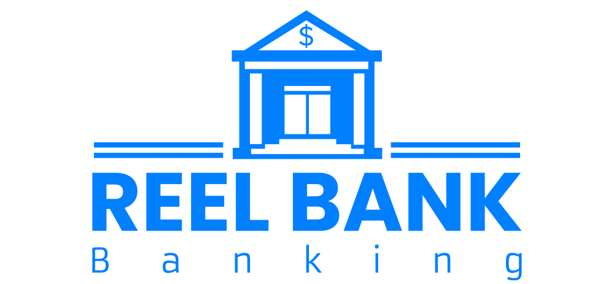
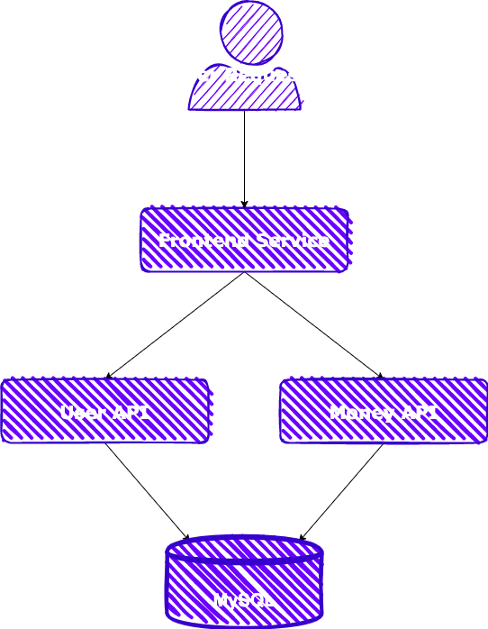

# Humanitec Bank Demo

---

Reel Bank is a modern cloud native microservices demo stack. Reel Bank consists of 3 microservices which handle the frontend web app as well as backend services. 

## View

You can view the deployed version here: [https://development-bank-demo.willthen.com/](https://prod-aws-bank-demo.aws.willthen.com/)

## Setup

### CI

This demo uses github actions for building docker images and pushing images to GCR.

Currently there is no automated testing 😎

### CD

Workloads are configured using [Score](https://score.dev) using individual score.yaml files located at `{service-name}/score.yaml` with humanitec specifics being located in `humanitec.score.yaml` extention files.

To deploy this demo as a new application you can use score-humanitec to deploy workloads.

#### Updates

There is no need to rerun score when code changes are made as humanitec will automatrically redeploy containers when new images become available.

### Infrastructure

This demo requires a MySQL database which is created using Humanitec

